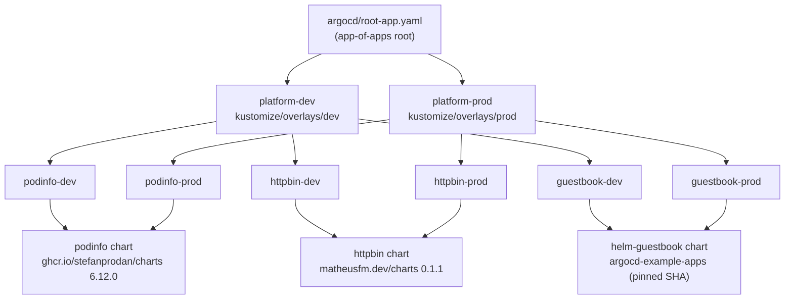

# gitops-reference-platform

[](https://github.com/Argarm/gitops-reference-platform/actions/workflows/ci.yml)
[](./LICENSE)

A reference GitOps platform built around ArgoCD's **app-of-apps** pattern, with
two environments (`dev` / `prod`), reproducible locally on
[kind](https://kind.sigs.k8s.io/) and documented for production on AKS.

Every manifest is statically validated, rendered with Kustomize, and dry-run
checked against ArgoCD on every pull request — **no live cluster is ever spun up
in CI**.

## The problem this solves

Imagine you have to migrate ~150 applications onto Kubernetes and keep them
running across multiple environments. Doing that with imperative `kubectl apply`
or hand-copied YAML per environment does not scale: drift creeps in, "what is
actually running in prod?" becomes unanswerable, and onboarding a new app means
re-inventing the same wiring every time.

GitOps fixes this by making **Git the single source of truth**: the desired
state of every environment lives in this repo, and ArgoCD continuously
reconciles the cluster to match it. This repository is a small, fully-working
**reference** for that model — three example workloads instead of 150, but with
exactly the structure, multi-environment story, RBAC scoping and test
automation you would use to scale to 150.

## Architecture

The platform uses ArgoCD's **app-of-apps** pattern. A single root manifest
declares one "parent" Application per environment; each parent points at a
Kustomize overlay that renders that environment's namespaces and the child
workload Applications; each child in turn renders a third-party Helm chart.



Apply one file and the whole tree materializes:

```bash
kubectl apply -f argocd/root-app.yaml
```

### Kustomize for the platform, Helm for third-party software

The two tools are used for the jobs they are each best at, and the boundary is
deliberate:

- **Helm** packages the third-party software (podinfo, httpbin, guestbook). We
  never fork or vendor these charts — each workload's ArgoCD Application
  references the upstream chart at a **pinned version** and supplies values via
  `source.helm.valuesObject`. ArgoCD renders the chart at sync time.
- **Kustomize** wires the *platform*: namespaces, the per-app Applications, and
  the per-environment overlays that patch them. Kustomize does **not** inflate
  the Helm charts; it only composes and patches the ArgoCD `Application`
  objects.

This keeps platform wiring fast-moving and reviewable while the deployed
software stays explicitly, auditably pinned. Adding the 150th app is "drop in
one more Application + a per-env patch", not "re-learn the platform".

### Why dev and prod differ

`dev` and `prod` are genuinely different environments, expressed as overlays
over a shared base rather than copied files:

| Aspect          | dev                     | prod                  |
| --------------- | ----------------------- | --------------------- |
| Replicas        | 1                       | 2–3 (scaled out)      |
| Resources       | small requests/limits   | larger requests/limits|
| Namespaces      | `*-dev`                 | `*-prod`              |
| Ingress host    | `*.dev.example.com`     | `*.example.com`       |
| Tracks branch   | `main`                  | `main`                |

Keeping them as overlays means the difference between environments is small,
explicit and visible in one place — exactly the diff a reviewer wants to see
before a prod change ships. The integration tests assert these differences hold
(prod runs more replicas; namespaces and ingress hosts differ), so the two
environments can never silently converge.

> **Naming note:** kustomize's `nameSuffix` gives every Application a
> `-dev`/`-prod` suffix so the two environments never collide in the `argocd`
> namespace. kustomize intentionally does not suffix `Namespace` names, so the
> overlays rename namespaces explicitly via JSON6902 patches kept in sync with
> each Application's destination.

## Repository layout

```
argocd/
  projects/platform-project.yaml   AppProject: RBAC + source/destination scoping
  root-app.yaml                    app-of-apps root (platform-dev, platform-prod)
bootstrap/
  kind-config.yaml                 reproducible local kind cluster (pinned node)
  install-argocd.sh                idempotent, pinned ArgoCD installer
  README.md                        step-by-step local bootstrap
kustomize/
  base/                            namespaces + base ArgoCD Applications
  overlays/dev|prod/               per-environment patches
tests/
  lib/common.sh                    shared kustomize shim + assertion framework
  unit|integration|e2e/run.sh      the three test layers
  README.md                        test-pyramid documentation
.github/
  actions/setup-tools/             composite action pinning the toolchain
  workflows/ci.yml                 unit -> integration -> e2e pipeline
```

## Quickstart (local, on kind)

The full, copy-pasteable walkthrough lives in
[`bootstrap/README.md`](./bootstrap/README.md). In short:

```bash
# 1. Create the local cluster
kind create cluster --name gitops-ref --config bootstrap/kind-config.yaml

# 2. Install ArgoCD (pinned, idempotent)
./bootstrap/install-argocd.sh

# 3. Register the project and bootstrap the app-of-apps
kubectl apply -f argocd/projects/platform-project.yaml
kubectl apply -f argocd/root-app.yaml
```

ArgoCD then reconciles both environments from Git.

## Production on AKS

The model is cloud-agnostic; only the cluster underneath changes. To run this
platform on Azure Kubernetes Service:

1. **Provision the cluster** with your IaC of choice (Terraform / Bicep), e.g.
   `az aks create` with a system node pool, Azure CNI and an appropriately sized
   user node pool. Pin the Kubernetes version.
2. **Point `kubectl` at AKS** (`az aks get-credentials -g <rg> -n <cluster>`).
   The installer targets the current context, so step 2 onward of the
   quickstart is identical.
3. **Install ArgoCD** with `./bootstrap/install-argocd.sh` (or your preferred
   HA/Helm-based ArgoCD install for production).
4. **Ingress & TLS** — deploy an ingress controller (e.g. ingress-nginx or the
   AKS application routing add-on) and cert-manager, then point the workloads'
   `*.example.com` hosts at your real DNS zone. The `className: nginx` in the
   overlays assumes an nginx-class controller.
5. **Identity & secrets** — back ArgoCD with Entra ID SSO mapped to the project
   `read-only` / `deployer` roles, and source any secrets from Azure Key Vault
   (e.g. via the Secrets Store CSI driver) rather than committing them — this
   repo contains none, and the unit tests fail the build if one appears.
6. **Scale to many apps** — the same overlay pattern carries from 3 to 150
   workloads; production differs from dev only in the overlay values
   (replicas, resources, hosts) and the cluster it targets.

The kind path and the AKS path share 100% of the Git content — that is the whole
point of GitOps.

## Test strategy

The repo is guarded by a three-layer **test pyramid**, all of it offline,
deterministic and free to run; CI chains the layers `unit -> integration ->
e2e`:

- **unit** — static lint + schema + structure checks (yamllint, every
  `Kustomization` valid, every Application complete, no committed secrets).
- **integration** — render the overlays, validate with `kubeconform -strict`
  against the Kubernetes + ArgoCD CRD schemas, and assert dev/prod actually
  differ.
- **e2e** — app-of-apps integrity plus offline ArgoCD acceptance of every
  Application (via `argocd admin app generate-spec`), with **no cluster spun
  up**.

Full rationale — including *why e2e stays dry-run only* — is in
[`tests/README.md`](./tests/README.md). Run any layer locally with
`bash tests/<layer>/run.sh`.

## License

[MIT](./LICENSE) © 2026 Aarón García Marrero
